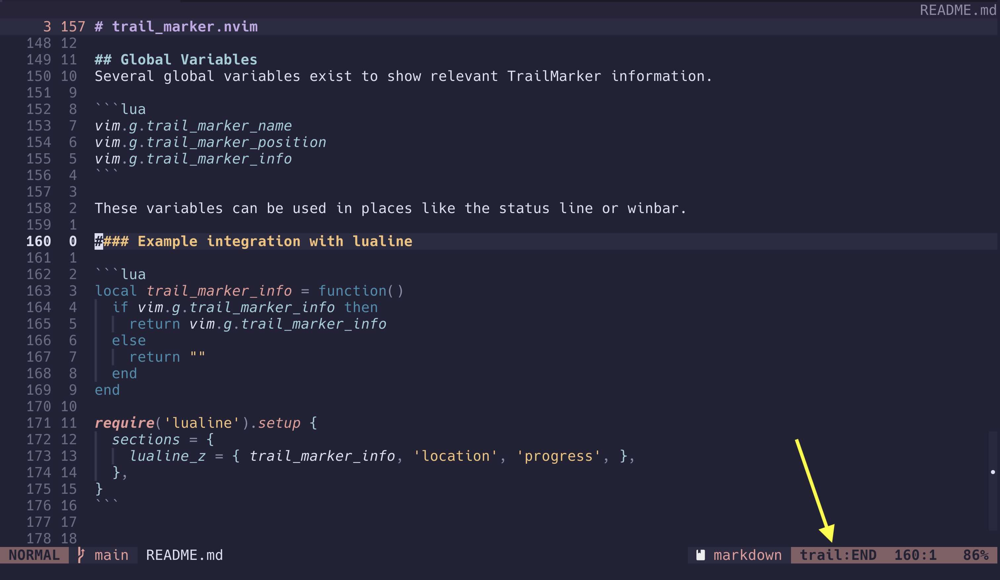

<div align="center">

# trail_marker.nvim
#### Hike frequented code paths

</div>

## Table of Contents
* [What are Trail Markers](#what-are-trail-markers)
* [Installation](#installation)
* [Example Keymaps](#example-keymaps)
* [Roadmap](#roadmap)


## What are Trail Markers
Trail markers highlight specific points in your code. Multiple markers make a trail. Trail markers are meant
to be traversed in order to guide you down a specific code path. Multiple trails can exist per project and
trails are always persisted through restarts, allowing you to go on your favorite hikes again and again.

Trail markers differ from [marks](https://neovim.io/doc/user/motion.html#mark-motions) in that you don't assign them
a letter. An ordered relationship is fundamental to the way trail markers are designed to be used. With trail
markers you don't need to remember how you named your marks.

The [jumplist](https://neovim.io/doc/user/motion.html#jump-motions) is the closest parallel to trail markers. Think of
trail markers as a more intentional jumplist that only populates when you tell it. No more smashing `<C-o>` to get
where you need to go.

Trail markers are a hybrid of marks and the jumplist.

## Installation

Install using [lazy.nvim](https://github.com/folke/lazy.nvim)

```lua
{
  "ryanburda/trail_marker.nvim"
}
```


## Example Keymaps

Trail Marker doesn't assign any default keymaps. The following should be modified to your liking and added to
your config.

```lua
vim.keymap.set(
  'n',
  '<leader>tm',
  require("trail_marker").trail_map,
  { desc = "Trail Marker: List markers on current trail" }
)

vim.keymap.set(
  'n',
  '<leader>ta',
  require("trail_marker").place_marker,
  { desc = "Trail Marker: Add marker to current trail" }
)

vim.keymap.set(
  'n',
  '<leader>td',
  require("trail_marker").remove_marker,
  { desc = "Trail Marker: Remove marker from current trail" }
)

vim.keymap.set(
  'n',
  '<leader>tt',
  require("trail_marker").current_marker,
  { desc = "Trail Marker: Go to current marker" }
)

vim.keymap.set(
  'n',
  '<leader>tj',
  require("trail_marker").next_marker,
  { desc = "Trail Marker: Go to next marker" }
)

vim.keymap.set(
  'n',
  '<leader>tk',
  require("trail_marker").prev_marker,
  { desc = "Trail Marker: Go to previous marker" }
)

vim.keymap.set(
  'n',
  '<leader>tgg',
  require("trail_marker").trail_head,
  { desc = "Trail Marker: Go to start of trail" }
)

vim.keymap.set(
  'n',
  '<leader>tG',
  require("trail_marker").trail_end,
  { desc = "Trail Marker: Go to end of trail" }
)

vim.keymap.set(
  'n',
  '<leader>tx',
  require("trail_marker").clear_trail,
  { desc = "Trail Marker: Remove all markers from trail" }
)

vim.keymap.set(
  'n',
  '<leader>tv',
  require("trail_marker").virtual_text_toggle,
  { desc = "Trail Marker: Toggle virtual text" }
)

vim.keymap.set(
  'n',
  '<leader>tl',
  require("trail_marker").leave_trail,
  { desc = "Trail Marker: Leave trail" }
)

-- User commands exist alongside their lua counterparts.
-- These are particularly useful when additional arguments need to be specified.
-- Trail name completion exists in the case of `change_trail` and `remove_trail`.
vim.keymap.set(
  'n',
  '<leader>tn',
  ':TrailMarker new_trail',
  { desc = "Trail Marker: New trail" }
)

vim.keymap.set(
  'n',
  '<leader>tc',
  ':TrailMarker change_trail',
  { desc = "Trail Marker: Change trail" }
)

vim.keymap.set(
  'n',
  '<leader>tr',
  ':TrailMarker remove_trail',
  { desc = "Trail Marker: Remove trail" }
)
```

## Global Variables
Several global variables exist to show relevant TrailMarker information.

```lua
vim.g.trail_marker_name
vim.g.trail_marker_position
vim.g.trail_marker_info
```

These variables can be used in places like the status line or winbar.

#### Example integration with lualine



Add the following to your lualine setup to show trail information in your status line.

```lua
local trail_marker_info = function()
  if vim.g.trail_marker_info then
    return vim.g.trail_marker_info
  else
    return ""
  end
end

require('lualine').setup {
  sections = {
    lualine_z = { trail_marker_info, 'location', 'progress', },
  },
}
```


## Roadmap
- Trail sharing
- Export as Github links
- Add notes to markers


##
~ Happy Hiking!
